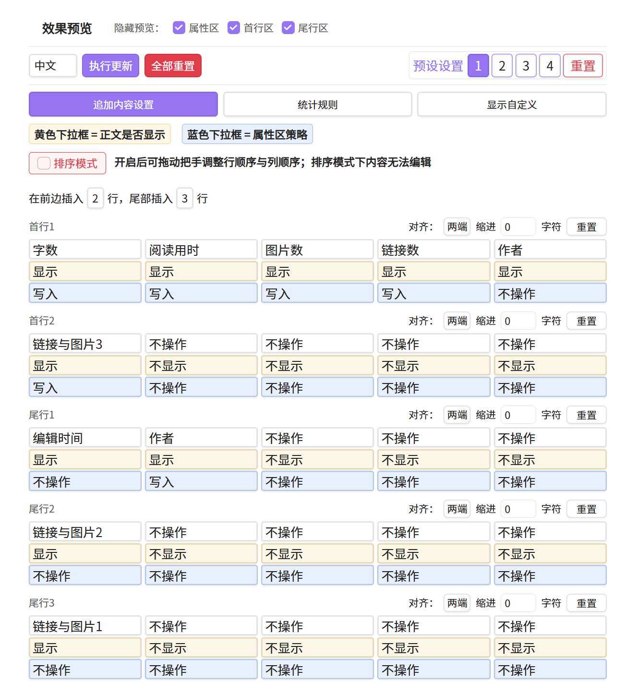
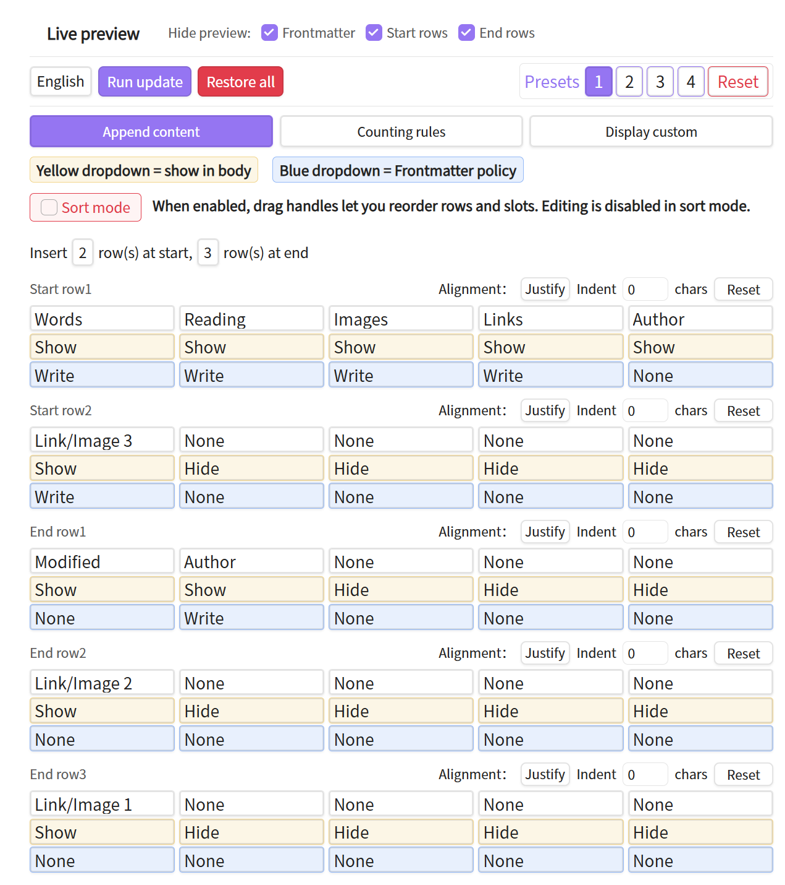
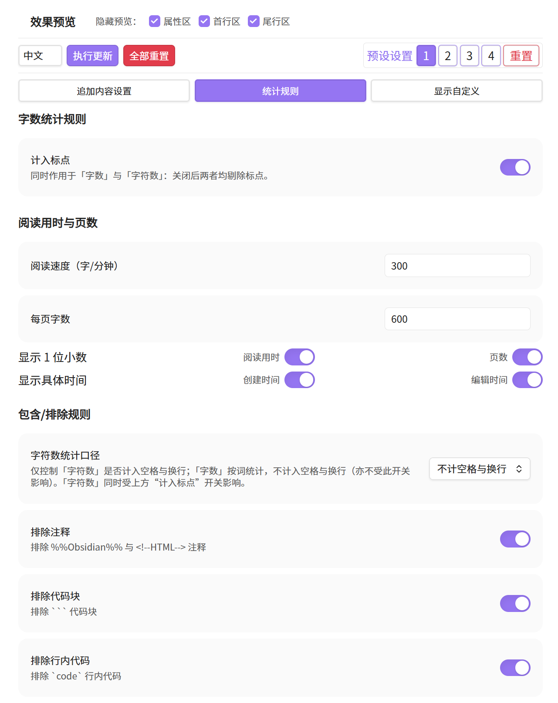
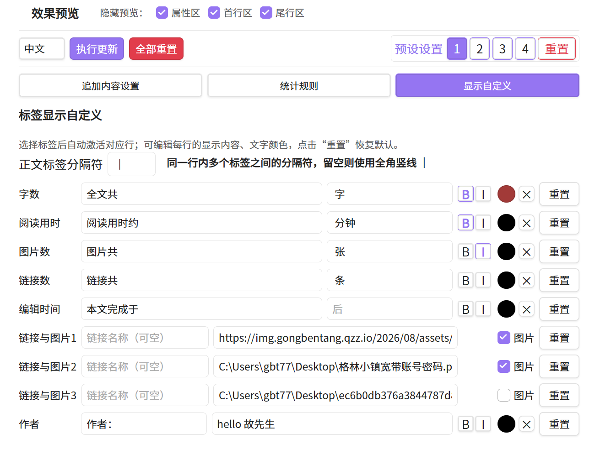

# Article Info Inserter 文章信息追加器

> [English Documentation / 英文文档](./README.en.md)

**简要描述（Brief）：** 在 Obsidian 笔记正文自动追加"文章信息行"——字数、阅读时间、图片数、创建/修改时间、自定义链接与图片等，支持 Frontmatter 属性组合与灵活排版。

**English summary:** Article Info Inserter is an Obsidian community plugin that automatically appends configurable article-info lines (word count, reading time, images, timestamps, custom links/images, etc.) to your Markdown notes. It supports Frontmatter properties, flexible alignment, and one-click refresh while replacing only its own `data-aii="marker"` block to avoid polluting your content.

---

## 一、功能简介

Article Info Inserter（文章信息追加器）是一款 Obsidian 社区插件，用于在 Markdown 笔记中**自动生成并维护一段"文章信息"**。你可以把它理解为"为每篇文章自动贴一个信息脚注"：

- 统计当前笔记的**字数、字符数、阅读时间、页数、图片数（本地/网络）、嵌入数、脚注数、代码行数、链接数**等；
- 读取并展示笔记 **Frontmatter（属性区）** 中的指定字段（如标题、分类、标签等）；
- 在正文**开头或末尾**以可配置的"标签位"形式插入一行或多行信息；
- 支持**自定义显示内容、对齐方式、缩进、链接/图片嵌入**；
- 每次编辑后一键"更新文章信息"，插件自动去重、增量更新，不会重复插入。

插件以 `data-aii="marker"` 的 HTML 块标记写入信息行，更新时只替换该区块内容，不破坏你的正文。

## 二、核心特性

| 特性 | 说明 |
|------|------|
| **多维度统计** | 字数、字符数、阅读时间、页数、图片（本地/网络）、嵌入、脚注、代码、链接等 13+ 指标 |
| **Frontmatter 组合** | 自由组合正文标签位与 Frontmatter 属性，统一展示 |
| **灵活排版** | 首行/尾行可分别配置，支持对齐（左/中/右/两端）与缩进 |
| **链接与图片** | 可插入自定义链接或网络/本地图片，自动去重与路径规范化 |
| **一键更新** | 命令面板"更新文章信息"，自动识别并替换旧标记，不重复插入 |
| **双语界面** | 设置界面完整中英文，随系统/手动切换 |
| **桌面端** | 当前版本依赖 Node `crypto`/`fs`，仅支持桌面端 Obsidian（`isDesktopOnly: true`） |

## 三、安装

### 方式一：社区插件市场（待审核上架后）
1. Obsidian 设置 → 社区插件 → 浏览；
2. 搜索 **Article Info Inserter**；
3. 安装并启用。

### 方式二：手动安装（BRAT 或手动放置）
1. 从 [GitHub Releases](https://github.com/gbt777/article-info-inserter/releases) 下载 `main.js` 与 `manifest.json`；
2. 放入 vault 的 `.obsidian/plugins/article-info-inserter/` 目录；
3. 在"社区插件"中启用（若未显示在列表，重启 Obsidian）。

## 四、使用步骤

1. 启用插件后，打开任意 Markdown 笔记；
2. 命令面板（Ctrl/Cmd+P）执行 **"更新文章信息"**；
3. 插件会在正文开头/末尾插入信息行；
4. 进入设置可调整：统计规则、显示内容、对齐、缩进、链接/图片等；
5. 修改设置后再次执行"更新文章信息"即可刷新。

## 五、设置项说明

- **统计规则**：是否计入标点、阅读速度（字/分钟）、是否计入空格与换行等。
- **显示自定义**：选择哪些指标显示、排序、每行对齐与缩进。
- **追加内容设置**：配置首行/尾行标签位、Frontmatter 属性策略（写入/删除/清空/不操作）、链接与图片。

## 六、⚠️ 1.0 → 2.0 升级注意事项（重要）

**1.0 版本使用 `*[...]` 行内标记框定信息区域**，由于 Obsidian 的样式渲染限制，该方式容易出错（如主题将 `***` 渲染为多彩字、标记被误识别等）。

**2.0 版本改用 `
` HTML 块方式**，更稳定、兼容性好。

> ⚠️ **样式不兼容声明**：2.0 与 1.0 的信息标记**完全不兼容**。如果你此前使用过 1.0 版本，升级到 2.0 后：
> - **必须手动删除旧的 `*[...]` 标记行**，否则旧标记不会被 2.0 识别或清理；
> - 删除旧标记后，重新执行"更新文章信息"即可生成新的 `div` 格式信息行。

## 七、🔧 可选：Word / DOCX 导出增强（进阶）

插件写入的是带 `data-aii="marker"` 的 HTML 块。若需通过 **Pandoc** 导出 Word/DOCX 并保留追加文字的**加粗、斜体、颜色**等样式，可搭配可选的 Lua 过滤器包（见仓库 `optional/word-export/` 目录，含 `aii-docx.lua` 与 `aii-image-center.lua` 及用法文档）。

> 注意：**导出 PDF 无此问题**——Pandoc 对 PDF（LaTeX）路径原生支持 HTML 行内样式，无需额外过滤器。仅 DOCX 输出需要本可选包。

详见：[可选功能包说明](./optional/word-export/README.md)

## 八、常见问题

**Q：为什么只支持桌面端？**
A：插件使用 Node `crypto`（图片 MD5 去重）与 `fs`（文件操作），移动端 Obsidian 受限环境无法运行，故标记 `isDesktopOnly: true`。

**Q：插件为什么要直接访问文件系统（Node `fs`）？**
A：`fs` 仅用于插件功能必需的文件操作：① 将用户配置的本地/网络图片复制到当前笔记所在 vault 的附件目录；② 计算图片内容 MD5 用于去重；③ 读取/写入本插件自身的数据文件（如 `data.json`）。不会访问或修改 vault 外的用户文件。

**Q：信息行会破坏我的正文吗？**
A：不会。插件以独立 HTML 块标记写入，更新时只替换该区块，正文原样保留。

**Q：如何彻底移除插件写入的信息？**
A：执行"更新文章信息"前，手动删除 `
…
` 区块即可；或禁用插件后清理。

## 九、运行截图

| 设置面板（中文） | 设置面板（英文） | 正文信息行效果 | Word 导出效果 |
|---|---|---|---|
|  |  |  |  |

## 十、许可证

MIT
