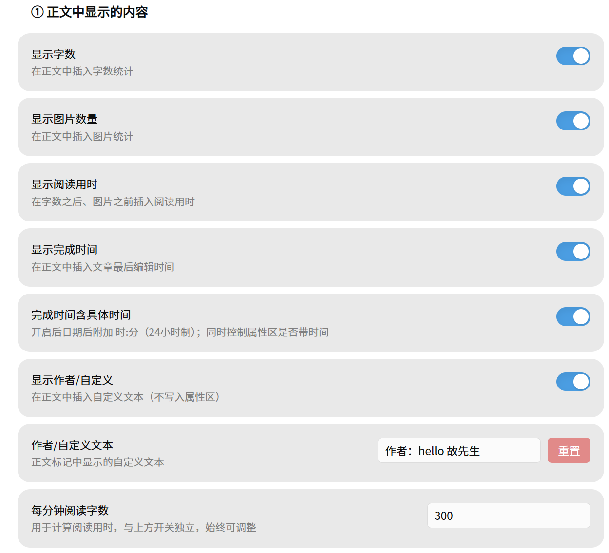
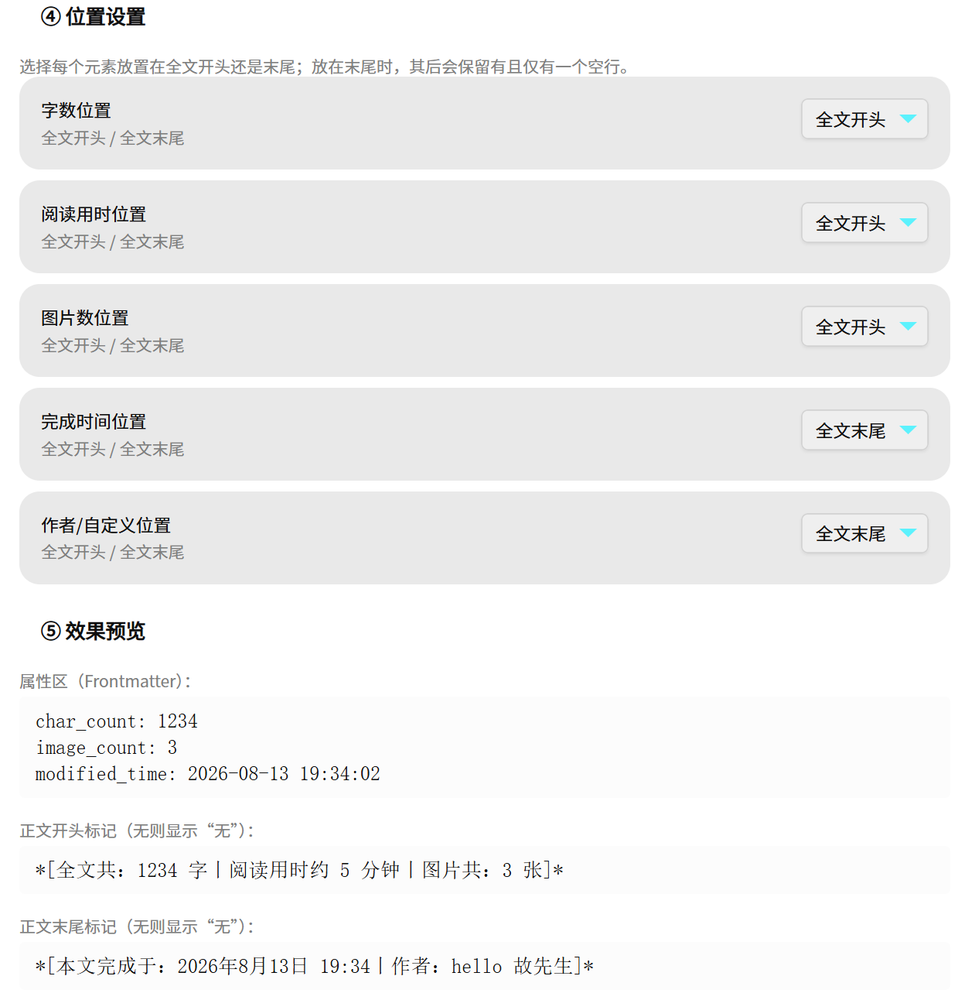
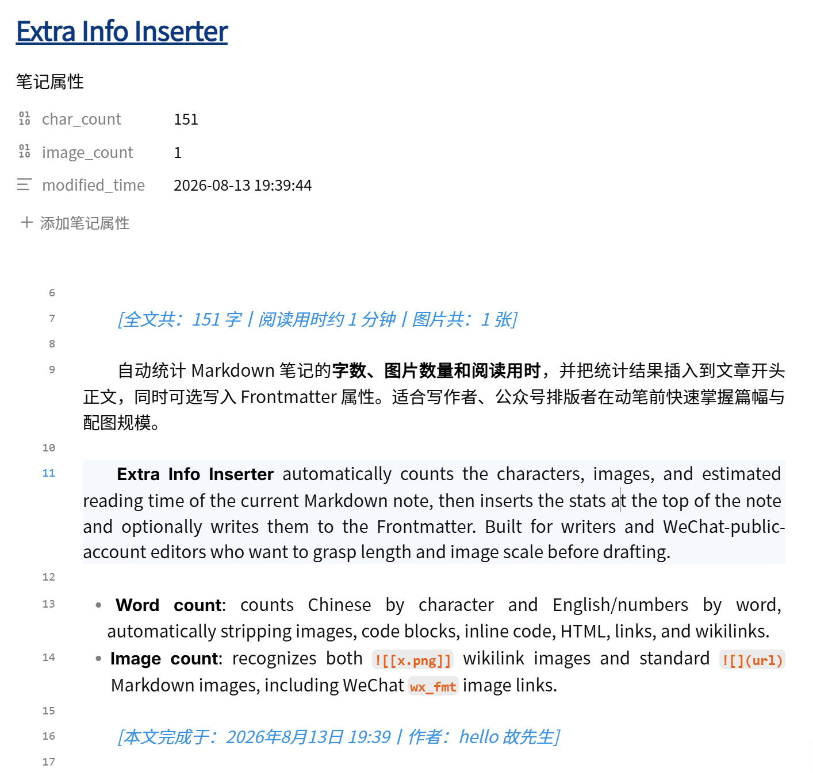

# Article Info Inserter（文章信息追加器）

> 本插件可一键在文章正文、属性区内插入字数、图片数、成文时间、作者信息等内容。
>
> This plugin lets you insert, with one click, the word count, image count, completion time, and author info into both the note body and its Frontmatter properties.

**Article Info Inserter** (中文名：文章信息追加器) automatically counts the characters, images, and estimated reading time of the current Markdown note, then inserts the stats at the top of the note and optionally writes them to the Frontmatter. It also supports inserting the note's completion time and a custom author / text line, with a fully localized **English interface**. Built for writers and WeChat-public-account editors who want to grasp length, image scale, and metadata before drafting.

**文章信息追加器（Article Info Inserter）** 自动统计 Markdown 笔记的**字数、图片数量、阅读用时、完成时间与作者信息**，并把统计结果插入到文章正文（开头或末尾）与 Frontmatter 属性区。界面支持**中文 / 英文**切换，适合写作者、公众号排版者在动笔前快速掌握篇幅与配图规模。

## Features / 功能介绍

- **Word count / 字数统计**: counts Chinese by character (including Chinese punctuation) and English/numbers by word, automatically stripping images, code blocks, inline code, HTML, links, and wikilinks.
  字数按字符统计（含中文标点），英文与数字按词统计；统计前会自动剔除图片、代码块、行内代码、HTML、链接与双链。
- **Image count / 图片数量**: recognizes both `![[x.png]]` wikilink images and standard `` Markdown images, including WeChat `wx_fmt` image links.
  同时识别 `![[x.png]]` 双链图片与标准 `` Markdown 图片，含微信公众号 `wx_fmt` 图片链接。
- **Reading time / 阅读用时**: estimated from a configurable words-per-minute rate (default 300).
  按可配置的「每分钟阅读字数」（默认 300）估算阅读用时。
- **Completion time / 完成时间**: inserts the note's last-modified time into both the body marker and Frontmatter (`modified_time`); the clock part (HH:mm / HH:mm:ss) is optional.
  将笔记最后编辑时间写入正文标记与属性区 `modified_time`；是否带具体时分可开关。
- **Author / custom text / 作者或自定义文本**: inserts a custom line (e.g. author name) into the body marker. Not written to Frontmatter.
  在正文标记中插入自定义文本（如作者署名），不写入属性区。
- **Position settings / 位置设置**: every element can be placed at the **start** or the **end** of the note.
  每个元素可独立选择放在全文开头或末尾。
- **Body marker / 正文标记**: inserts a line like `*[全文共: 1234字，图片共: 3张，本文完成于：2026年8月14日 16:30]*`; prefix, units, and separators are customizable.
  正文标记形如 `*[全文共: 1234字，图片共: 3张]*`，前缀、单位、分隔符均可自定义。
- **Frontmatter strategy / 属性区策略**: `char_count` / `reading_time` / `image_count` / `modified_time` can each be set to **write / delete / clear**.
  上述字段在属性区可分别设置为**写入 / 删除 / 清空**。
- **Bilingual UI / 中英双语界面**: switch the whole settings interface between 中文 and English from the top dropdown.
  设置界面顶部可一键切换中文 / 英文。
- **Manual trigger / 手动触发**: click the ribbon icon or run the command "更新字数与图片统计" (Update word & image stats). It never rewrites on file open, so it is safe and predictable.
  点击 ribbon 图标或运行命令即可；不会在打开文件时自动改写，安全可预期。

## Screenshots / 运行截图

| 设置面板（中文） | 设置面板（英文） | 正文标记效果 |
|---|---|---|
|  |  |  |

## ⚠️ Warning / 使用警示

> 插件清除旧的文章信息标记使用的是格式匹配：凡是符合「\*[XXX]\*」格式的行都会被删除。因此使用本插件时，请勿在笔记中自行设置这种格式；另外，添加信息标记后，如果调整了标记格式，也会导致再次执行时无法清除旧有标记。

> The plugin clears old article-info markers by format matching: any line matching the `*[XXX]*` format will be deleted. Therefore, do not manually set this format in your notes. Also, after the marker is added, if you change the marker format, re-running the plugin will not be able to clear the old marker.

## Installation / 安装

1. In Obsidian, open **Settings → Community plugins** and turn off Safe mode.
   在 Obsidian 中打开 **设置 → 第三方插件**，关闭安全模式。
2. Browse, search for `Article Info Inserter` (or `article-info-inserter`), then install and enable.
   浏览社区插件，搜索 `Article Info Inserter`（或 `article-info-inserter`），安装并启用。

### Beta via BRAT
1. Install and enable the BRAT plugin.
2. BRAT settings → Add Beta plugin → paste `gbt777/article-info-inserter`.
3. Enable the plugin.

## Usage / 使用

1. Open any Markdown note.
   打开任意 Markdown 笔记。
2. Click the ribbon icon, or run the command **更新字数与图片统计** (Update word & image stats).
   点击 ribbon 图标，或运行命令 **更新字数与图片统计**。
3. The plugin inserts a stats line into the note and updates the Frontmatter per your settings.
   插件会在笔记中插入统计行，并按设置更新 Frontmatter。

> Each run first removes the previously inserted stats line before rewriting, so it never stacks duplicates.
> 每次执行会先清除此前插入的统计行再重写，不会叠加重复内容。

## Settings / 设置

| Group / 分组 | Option / 选项 | Description / 说明 |
|---|---|---|
| Body display / 正文显示 | Show word count / 显示字数 · Show image count / 显示图片数量 · Show reading time / 显示阅读用时 · Show completion time / 显示完成时间 · Show author / 显示作者 | Controls which metrics appear in the body marker line |
| Body display / 正文显示 | Words per minute / 每分钟阅读字数 | Used to compute reading time; always adjustable |
| Frontmatter / 属性区 | Enable Frontmatter writing / 启用属性区写入 | Master switch |
| Frontmatter / 属性区 | char_count / reading_time / image_count / modified_time | Each set to write / delete / clear |
| Body text / 正文文案 | Prefix / unit / separator / 前缀·单位·分隔符 · Completion-time prefix / 完成时间前缀 · Author text / 作者文本 | Customize output text |
| Position / 位置 | Word / Reading / Image / Time / Author position | Start or end of the note |

## Compatibility / 兼容性

- Relies on Obsidian core APIs; **mobile-compatible** (`isDesktopOnly: false`).
  仅依赖 Obsidian 核心 API，**支持移动端**（`isDesktopOnly: false`）。
- Requires Obsidian `1.0.0` or later.
  需要 Obsidian `1.0.0` 及以上。

## Changelog / 更新日志

### 1.1.0
- Added **completion time** (body + Frontmatter `modified_time`) and a customizable **author / custom text** line.
  新增**完成时间**（正文 + 属性区 `modified_time`）与可自定义的**作者/自定义文本**行。
- Added **position settings**: every element can be placed at the start or the end of the note.
  新增**位置设置**：每个元素可置于全文开头或末尾。
- Added a fully localized **English interface** (switch from the top dropdown); README is now bilingual.
  新增完整**英文界面**（顶部下拉切换）；README 改为中英双语。
- Fixed the counting rule: **Chinese punctuation** is now included in the character count (previously only Han characters were counted).
  修正统计规则：**中文标点**现已计入字数（此前仅统计汉字）。
- Added the **usage warning** to both the settings panel and this page.
  在设置面板与本页均加入**使用警示**。

### 1.0.2
- Added the official Chinese name **文章信息追加器** (English name `Article Info Inserter` unchanged).
  增加官方中文名**文章信息追加器**（英文名 `Article Info Inserter` 不变）。
- Release assets now ship with GitHub artifact attestations (build provenance) so users can cryptographically verify `main.js` originates from this repo.
  Release 资产现附带 GitHub artifact attestations（构建溯源），用户可密码学验证 `main.js` 来自本仓库。

### 1.0.1
- Fixed the settings preview not refreshing when editing prefix/unit fields — the effect preview now updates live.
  修复设置预览在编辑前缀/单位时不刷新的问题——效果预览现已实时更新。

### 1.0.0
- Initial release: word / image / reading-time stats, body marker + Frontmatter strategy.
  首发：字数 / 图片 / 阅读用时统计，正文标记 + 属性区策略。

## License / 许可证

[MIT](./LICENSE) © 2026 gbt777
