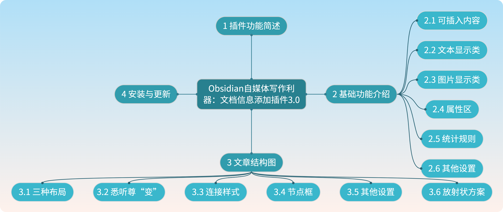
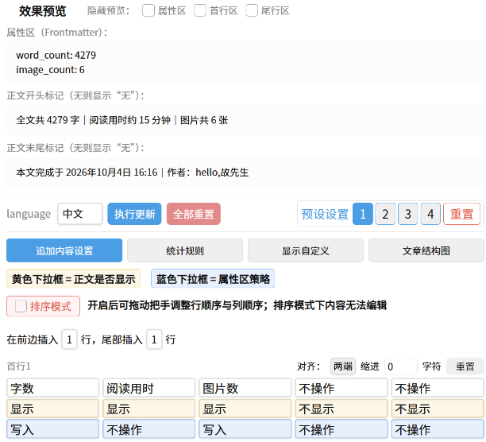
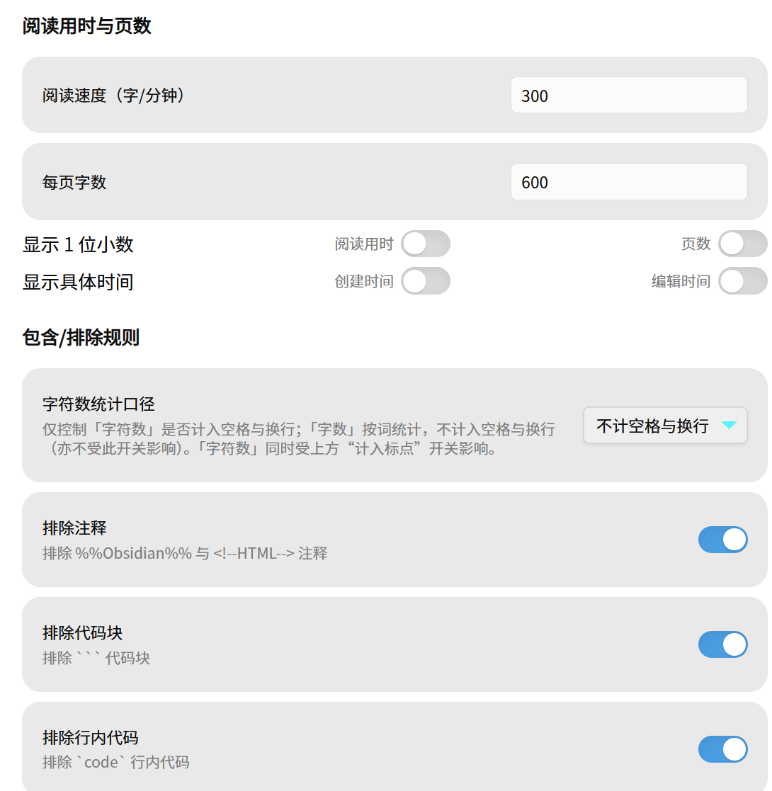
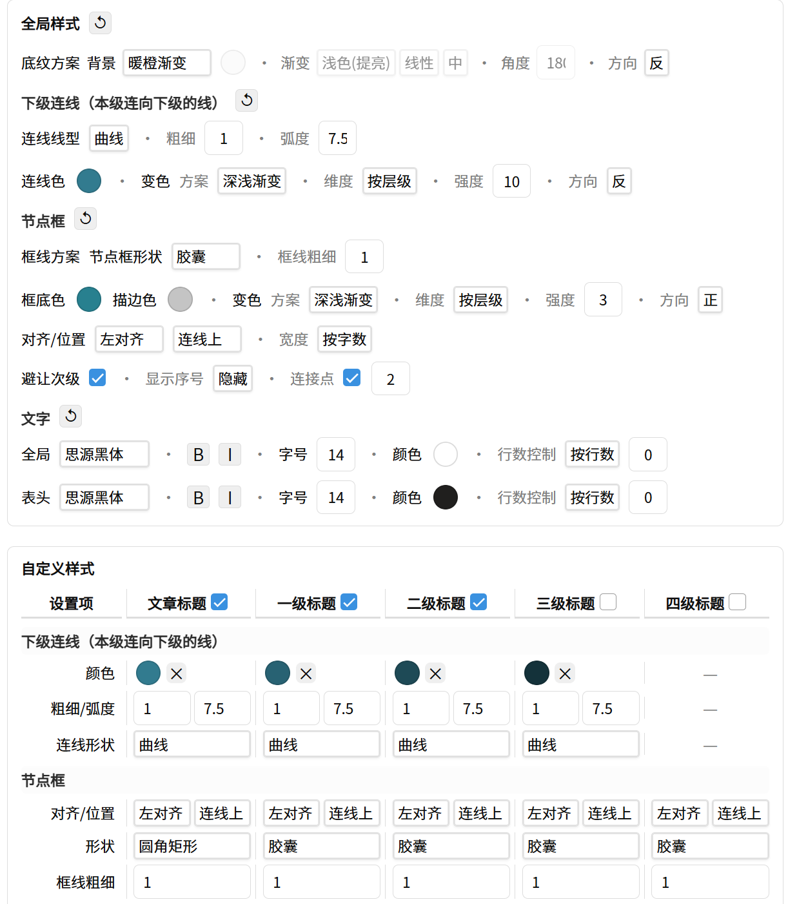
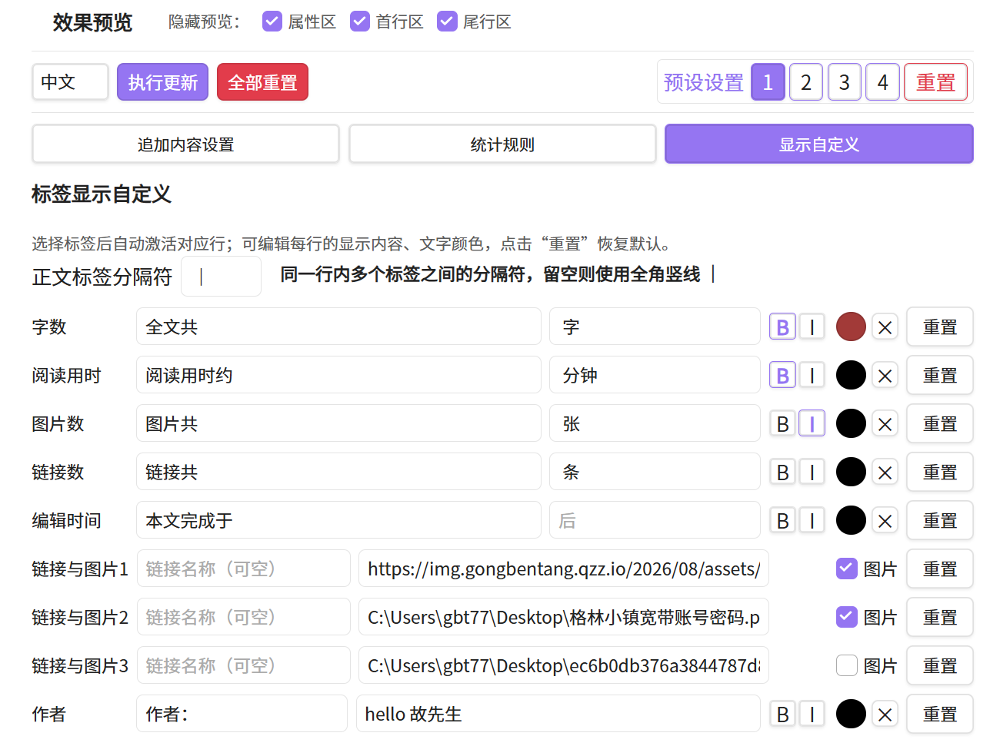

# Article Info Inserter · 文章信息追加器

**[中文完整图文使用教程 →](docs/中文使用教程.md)**

> **文章信息追加器**：在文章的属性区、开头三行、末尾三行，按照你的设置，一键插入自动统计出来的文档信息、或者你的自定义内容；点一下更新，这些内容还会按照文章当前状态重新统计、自动变更。这些信息包括：文字统计，图片统计，各种特殊块统计，编辑标记，作者名，自定义文字、图片、链接，自动生成“文章结构思维导图”。以上可插入内容都拥有丰富的自定义选项，可按你的喜好 DIY。

---

## English

**Article Info Inserter** is an Obsidian community plugin. With one click it inserts
auto-counted document info — or your own custom content — into the note's
frontmatter, its first three lines, or its last three lines, exactly as you
configure it. Press *Update* and everything is re-counted from the note's current
state; the previous insertion is replaced in place, so nothing is duplicated.

What you can insert: word, image and block statistics, edit marks, author name,
custom text, images and links, plus an auto-generated article structure mind map.
Every one of them comes with rich customization options — DIY it however you like.

### What it can insert

| Group | Available items |
|---|---|
| **Text stats** | word count, character count, reading time, page count |
| **Image stats** | total images, local images, network images |
| **Blocks** | embeds, links, comments, footnotes, code blocks |
| **Edit marks** | created time, modified time (date-only or full timestamp), author |
| **Fixed media** | 4 configurable link / image slots |
| **Free form** | 3 custom text slots |
| **Content frame** | the article structure mind map (3.0) |

Every item is optional, orderable, and styleable. Up to 3 lines can be inserted at
the head and 3 at the tail (6 in total), each with its own alignment and
indentation.

### Article structure mind map (new in 3.0)

Point the plugin at a note and it draws the outline as an SVG mind map, inserts the
image link, and refreshes it whenever the outline changes — no more screenshotting
a mind-map plugin by hand.

- **Three layouts** — horizontal (a comb), vertical (roots running downward), and
  radial (branching out from the article title).
- **Global style + per-level overrides.** Set the look once globally; every level
  follows. Then fine-tune individual levels in the custom matrix.
- **Color schemes** — solid, shade ramp, analogous, complementary, contrast,
  triadic, and rainbow, driven by a base color; with strength (0–10), dimension
  (by level / by chapter), and direction (forward / reverse).
- **Connectors** — line shape (arc, right angle, straight), width, curvature, and
  optional joint dots.
- **Node boxes** — capsule, rounded, rectangle, underline, or none, with fill,
  stroke, stroke width, text alignment, text position, and equal-width columns.
- **Backgrounds** — solid, several gradients, or your own custom gradient.
- **Line wrapping** — cap a line by character count, or split a label into *N*
  lines.
- **Radial angle system** — a start angle and a per-sibling offset angle; the
  plugin widens the angles (and only then the radius) when the diagram does not fit.

### Installation

**From the community plugin market (recommended)**

1. Settings → Community plugins → Browse;
2. search **Article Info Inserter** or **文章信息追加器**;
3. install and enable.

**Manual install**

1. Download `main.js` and `manifest.json` from
   [Releases](https://github.com/gbt777/article-info-inserter/releases);
2. put them in `<vault>/.obsidian/plugins/article-info-inserter/`;
3. enable the plugin under Community plugins (restart Obsidian if it does not
   appear in the list).

### Quick start

1. Open any Markdown note.
2. Run **Update article info** (ribbon icon, command palette, or your own hotkey).
3. The configured info lines are inserted at the head and/or tail of the note.
4. Open the plugin settings to change what is counted, which items are shown, how
   they are aligned, and which images or links are inserted.
5. Run **Update article info** again after editing — the block is replaced, not
   appended.

### Settings at a glance

- **Append content** — count of head/tail lines, the item picked for each slot,
  alignment, indentation, and the Frontmatter policy (the blue dropdowns).
- **Statistics rules** — how words are counted: punctuation, code blocks,
  comments, links, embeds, LaTeX, emoji, and so on.
- **Display customization** — bold, italic, and color per element, plus the custom
  text used for each slot.
- **Article structure** — layout, global style, per-level overrides, and the
  background/gradient options for the mind map.

| Append content | Statistics rules | Global and per-level styles |
|---|---|---|
|  |  |  |

Also available: **four independent presets** you can switch between with one click
(one per platform, for example), a **bilingual UI** (Chinese / English), and **no
automatic refresh** — updating is always an explicit action.

### Frontmatter policy

For each slot you can choose what happens to the note's Frontmatter:

| Option | Effect |
|---|---|
| Leave | do nothing, keep the Frontmatter as it is |
| Write | create the field and write the value |
| Delete | remove the field and its value |
| Clear | keep the field but empty its value |

This lets tools that read Frontmatter — the built-in Bases, Dataview, and similar —
query the numbers the plugin computed.

> Note: the plugin **writes its own computed values** into the Frontmatter. It does
> not read and display your existing properties. Editing Frontmatter is not the
> plugin's focus; if you need fine-grained property management, use a dedicated
> plugin.

### Styling and Word / DOCX export

Info lines are written as a single-line HTML block,
`
…
`. On each update the plugin removes the block it
inserted last time under that marker and re-inserts the fresh one, so your own
text is never touched. Bold, italic, and color can be applied per element, and the
resulting line exports cleanly to PDF and HTML.

Exporting to **Word / DOCX** with those styles preserved takes one extra step — an
optional Pandoc filter pack shipped in
[`optional/word-export/`](optional/word-export/README.md). Without custom styling
no extra step is needed.

| Word export |
|---|
|  |

### Good to know

- **Desktop only.** The plugin uses Node `crypto` and `fs` for image MD5
  de-duplication and for copying images into your attachment folder, so it is
  marked `isDesktopOnly: true` and does not run on mobile.
- **File system access** is limited to that: reading a configured image path,
  computing its MD5, and copying it into the vault. Nothing outside the vault is
  modified.
- **Images are de-duplicated by content MD5.** Images have no surrounding marker
  of their own, so the plugin compares the MD5 of nearby images: a match means
  "this is mine, replace it", a mismatch means "this is yours, leave it alone". If
  you swap an inserted image by hand, delete it manually once.
- **One image per line.** A line holding more than one image (or other content)
  cannot render in full; the plugin warns you, and the warning can be turned off.
- **Radial layouts are the least predictable.** Well-balanced outlines look great;
  lopsided ones can look odd. Horizontal is the most stable choice for long,
  deeply nested notes.
- **Statistics exclude the plugin's own output.** Before counting, the previous
  insertion is removed so the numbers describe only what you wrote. Images are the
  exception — you decide whether plugin-inserted images count.

### Repository layout

| Path | Purpose |
|---|---|
| `main.js`, `manifest.json` | the plugin itself |
| `docs/中文使用教程.md` | full Chinese walkthrough |
| `docs/release-notes-*.md` | per-version release notes |
| `optional/word-export/` | Pandoc filters for styled DOCX export |
| `PUBLISH.md` | release process notes for maintainers |

### License

MIT
